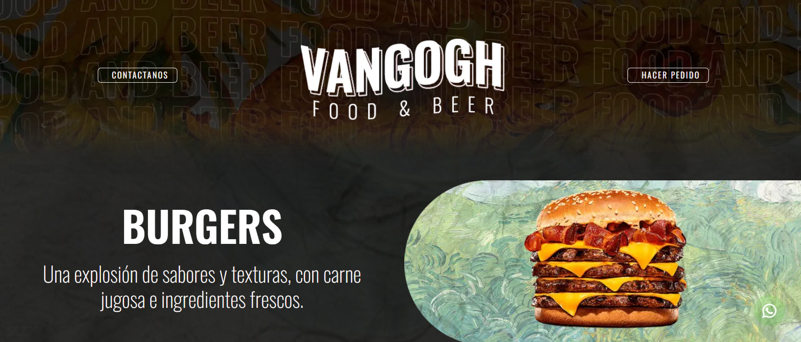

# HTML BASE SITE - BURGERS

## 🇬🇧 English

This is a basic multi-page website built using HTML, CSS, and Bootstrap. It includes a homepage, burger menu pages, contact pages, a top navigation bar (app bar), and a footer. While it features some e-commerce-style placeholders, this is **not** a functional online store—just a **demo** of what a burger restaurant website could look like.

### ✨ About the Project

This project was created at the beginning of my web development training. Both the **design** and **development** were done entirely by me.

### 🛠️ Features

- Responsive layout using **Bootstrap**
- Multiple static pages (no JavaScript logic)
- Manually added placeholder products
- App bar and footer
- Contact and navigation pages
- No database or dynamic content

### 📌 Notes

All product listings are hardcoded into the HTML for demonstration purposes. There is no backend integration—this site is purely front-end and static.

  

## 🇪🇸 Español

Este es un sitio web multipágina básico desarrollado con HTML, CSS y Bootstrap. Incluye una página de inicio, páginas del menú de hamburguesas, páginas de contacto, una barra de navegación superior (app bar) y un pie de página (footer). Aunque presenta algunos elementos tipo e-commerce, se trata simplemente de una **demo** de cómo podría verse el sitio web institucional de una hamburguesería.

### ✨ Sobre el Proyecto

Este proyecto fue realizado al comienzo de mi formación en desarrollo web. Tanto el **diseño** como el **desarrollo** fueron hechos completamente por mí.

### 🛠️ Características

- Maquetado responsive con **Bootstrap**
- Múltiples páginas estáticas (sin lógica JavaScript)
- Productos cargados manualmente como placeholders
- App bar y footer integrados
- Páginas de contacto y navegación
- No cuenta con base de datos ni contenido dinámico

### 📌 Notas

Todos los productos visibles están cargados de manera manual en HTML como ejemplo. No hay ninguna funcionalidad de backend: el sitio es completamente estático.
